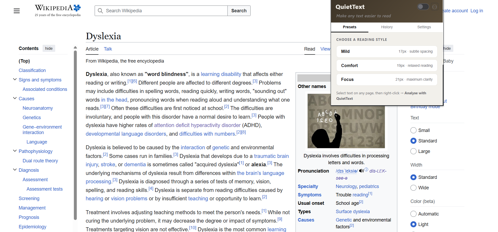
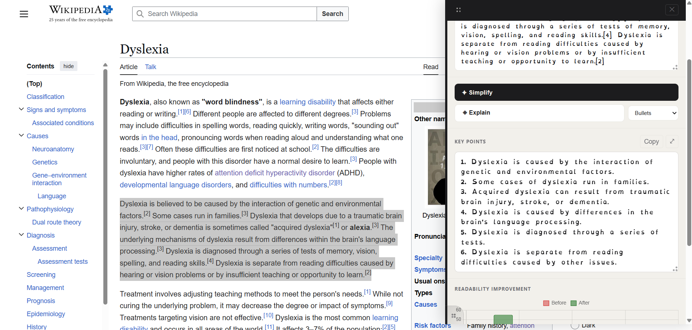
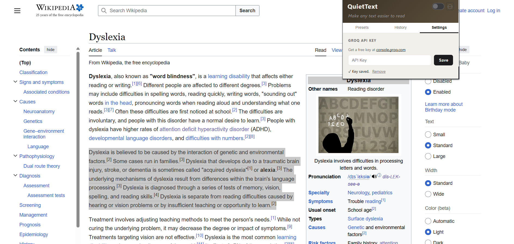

# QuietText

Dyslexia affects around 10-15% of people worldwide. Reading online can be exhausting when text is too small, cramped, or complex. To solve this problem, I made QuietText, a Chrome extension that makes any webpage easier to read.

This is my BTech CSE 6th semester minor project at Jamia Hamdard University.

## What it does

QuietText helps you read better in three ways:

1. **Reading Presets** - Apply dyslexia-friendly fonts and spacing to any webpage. Choose from Mild, Comfort, or Focus modes.

2. **AI Simplification** - Select any text, and I'll simplify it using AI. You can also get explanations in plain language, bullet points, or step-by-step breakdowns.

3. **Smart Highlight** - Highlight any confusing text and wait 2 seconds. A tooltip automatically appears with a quick 2-3 sentence explanation. No buttons to click, just highlight and learn.

## Features I built

- Three reading presets with OpenDyslexic font
- AI text simplification using Groq API
- Smart highlight tooltip - automatic explanations when you highlight text
- Floating panel that you can drag and resize
- History of your last 5 simplifications
- Keyboard shortcut (Ctrl+Shift+Q) to open the panel
- Works on any website

## How to set it up

1. Download or clone this project
2. Open Chrome and go to `chrome://extensions`
3. Turn on "Developer mode" (top right)
4. Click "Load unpacked" and select the project folder
5. The extension icon will appear in your toolbar

## Getting your API key

I'm using Groq's free API for the AI features. Here's how to get your key:

1. Go to [console.groq.com](https://console.groq.com)
2. Sign up for a free account
3. Create a new API key
4. Copy the key (starts with `gsk_`)
5. Click the QuietText icon in Chrome
6. Go to Settings tab
7. Paste your API key and click Save

That's it! Now you can simplify any text on the web.

## How to use it

**For reading presets:**
- Click the extension icon
- Toggle it on
- Pick a preset (Mild, Comfort, or Focus)
- The whole page will change

**For AI simplification:**
- Select any text on a webpage
- Press Ctrl+Shift+Q (or right-click → Analyse with QuietText)
- Click Simplify or Explain
- Done!

**For smart highlight:**
- Highlight any confusing text on a webpage
- Hold the selection for 2 seconds
- A tooltip automatically appears with a quick explanation
- The tooltip uses OpenDyslexic font for easy reading

## Why I built this

Dyslexia is not a measure of intelligence. It's just a different way of processing information. Some of the most brilliant minds in history were dyslexic - Einstein, Da Vinci, Steve Jobs. But the web isn't built for them.

I wanted to change that, even if just a little bit.

### About the OpenDyslexic font

I chose OpenDyslexic because research shows it helps. The font has weighted bottoms that make letters feel "anchored" to the baseline, reducing the visual confusion that happens when letters flip or swap. Each letter has a unique shape, making it harder to mistake one for another.

Studies have found that increased letter spacing and word spacing significantly improve reading speed and comprehension for people with dyslexia. That's why all three presets use wider spacing - it's not just aesthetic, it's functional.

### About the AI simplification

Sometimes the problem isn't the font, it's the complexity. Academic papers, legal documents, technical articles - they're written in a way that's hard for anyone to parse, let alone someone with dyslexia.

I built the AI simplification feature to break down complex text into shorter sentences, simpler words, and clearer structure. It's like having a patient friend who explains things without making you feel dumb.

## Tech I used

- Vanilla JavaScript (no frameworks)
- Groq API (llama-3.1-8b-instant model)
- OpenDyslexic font
- Chart.js for readability metrics
- Chrome Extension Manifest V3

## Screenshots

### 1. Reading Presets

*Choose from Mild, Comfort, or Focus reading modes*

### 2. AI Simplification Panel

*Drag and resize the panel, see simplified text and readability metrics*

### 3. Settings

*Add your Groq API key here*

---

Made by Ashhar Ahmad Khan 

Enrollment No - 2023-310-059
